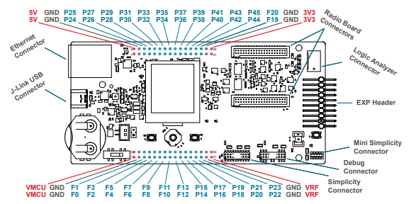
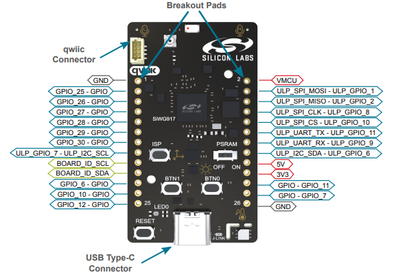
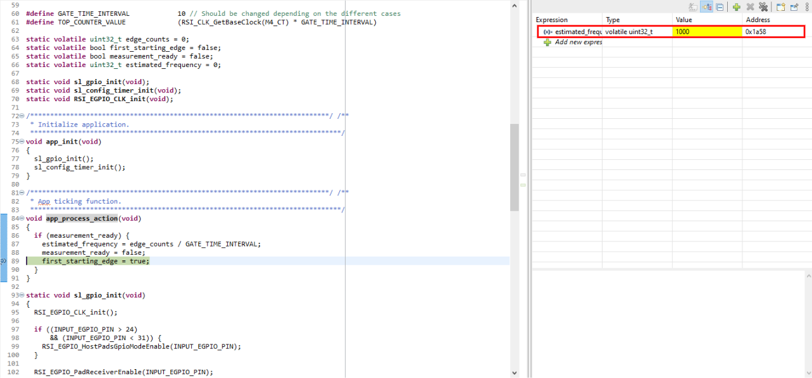

# Peripheral Example - Config Timer - Fixed Gate Time Frequency Measurement #

## Summary ##

This project demonstrates frequency measurement using the Gate Time Interval method. The timer is configured to count the number of input signal edges (pulses) that occur within a fixed gate time window. At the end of each gate interval, the frequency is calculated based on the number of pulses counted during that interval.

This approach is ideal for measuring the frequency of periodic signals, especially for low-frequency signals. The measured value will show 1000 for an input signal with a frequency of 1 kHz.

## SDK Version ##

- [SiSDK v2025.6.0](https://github.com/SiliconLabs/simplicity_sdk/releases/tag/v2025.6.0)

## Software Required ##

- [Simplicity Studio v5 IDE](https://www.silabs.com/developers/simplicity-studio)

## Hardware Required ##

- 1x Silicon Labs Si91x device, such as:
  - [SIWX917-DK2605A](https://www.silabs.com/development-tools/wireless/wi-fi/siwx917-dk2605a-wifi-6-bluetooth-le-soc-dev-kit)
  - [SIWX917-RB4338A](https://www.silabs.com/development-tools/wireless/wi-fi/siwx917-rb4338a-wifi-6-bluetooth-le-soc-radio-board?tab=overview)
- A source of periodic signal, which should be connected to the input GPIO

## Connections Required ##

- Connect the periodic signal to the input GPIO pin, which is GPIO_25 for both BRD2605A and BRD4338A (P25 on the breakout pad):

  

  

- Additionally, make sure that the source of the periodic signal and the board share the same ground (GND).

> [!TIP]
> Refer to the official Silicon Labs documentation for the correct hardware layout of the board.

## Setup ##

### Create from EXAMPLE PROJECTS & DEMOS ###

1. From the Launcher Home, add your hardware to My Products, click on it, and go to the EXAMPLE PROJECTS & DEMOS tab. Find the example project by filtering for "gate time interval - frequency measurement".

2. Create the project in Simplicity Studio.

### Create from an empty example project ###

1. Create an "Empty C Project" for your board using Simplicity Studio v5. Use the default project settings.

2. Copy the .c files 'src/app.c' to the following directory of the project root folder (overwriting the existing files).

## How It Works ##

The gate time interval method uses a timer to define a fixed time window (gate interval), during which the number of input signal edges (pulses) is counted. At the end of each gate interval, the frequency is calculated as:

    Frequency (Hz) = Number of pulses counted / Gate time interval (seconds)

This method is especially useful for measuring the frequency of low-frequency signals, as it improves accuracy by increasing the gate interval. The timer module is configured to generate an interrupt at the end of each gate interval, at which point the pulse count is read and the frequency is updated.

## Testing ##

It is recommended to check the measured frequency in debug mode, as printing may affect timing and lead to inaccurate readings. Connect the signal source to the input capture pin. Enable debug mode, set a breakpoint after the frequency calculation, and observe the measured value. The result should be similar to the following:

## Reporting Bugs/Issues and Posting Questions and Comments ##

To report bugs in the Application Examples projects, please create a new "Issue" in the "Issues" section of this repo. Please reference the board, project, and source files associated with the bug, and reference line numbers. If you are proposing a fix, also include information on the proposed fix. Since these examples are provided as-is, there is no guarantee that these examples will be updated to fix these issues.

Questions and comments related to these examples should be made by creating a new "Issue" in the "Issues" section of this repo.
