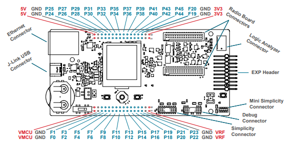
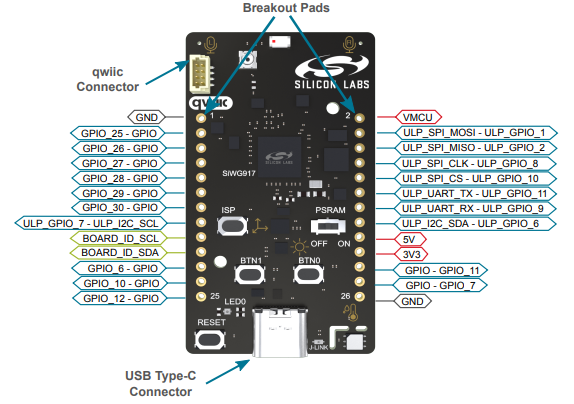
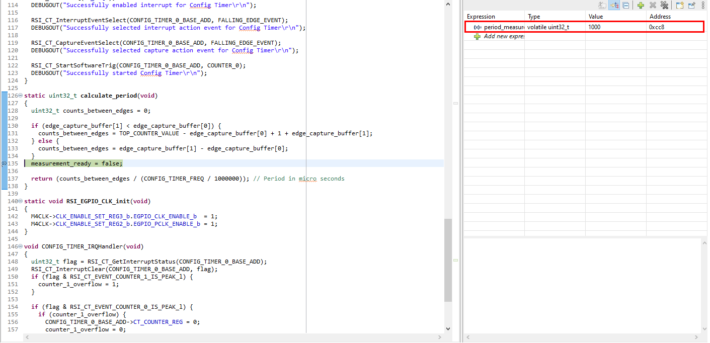

# Peripheral Example - Config Timer - Period Measurement #

## Summary ##

This project demonstrates period measurement using Config Timer. This project configures the timer to request an interrupt after falling edges occur. In the IRQ handler, in addition to saving the edge times, the overflow flag is checked in order to account for two edges that span the time during which the counter rolls over from 0xFFFFFFFF (Counter 0 is 32 bits wide) to 0...

Upon exiting the IRQ handler, the period is calculated and returned as an integer value in microseconds, thus the measuredPeriod value will
show 1000 for an input signal with a period of 1 kHz.

## SDK Version ##

- [SiSDK v2024.12.2](https://github.com/SiliconLabs/simplicity_sdk/releases/tag/v2024.12.2)

## Software Required ##

- [Simplicity Studio v5 IDE](https://www.silabs.com/developers/simplicity-studio)

## Hardware Required ##

- 1x Silicon Labs Si91x device, such as:
  - [SIWX917-DK2605A](https://www.silabs.com/development-tools/wireless/wi-fi/siwx917-dk2605a-wifi-6-bluetooth-le-soc-dev-kit)
  - [SIWX917-RB4338A](https://www.silabs.com/development-tools/wireless/wi-fi/siwx917-rb4338a-wifi-6-bluetooth-le-soc-radio-board?tab=overview)
- A source of periodic signal, which should be connected to the input GPIO

## Connections Required ##

- Connect the periodic signal to the input capture GPIO pin, which is GPIO_25 for both BRD2605A and BRD4338A (P25 on the breakout pad):

  

  

> [!TIP]
> It is recommended to refer to the official Silicon Labs documentations to get the correct hardware layout of the board.

## Setup ##

### Create from EXAMPLE PROJECTS & DEMOS ###

1. From the Launcher Home, add your hardware to My Products, click on it, and click on the EXAMPLE PROJECTS & DEMOS tab. Find the example project filtering by "config timer - period measurement".
2. Create the project in Simplicity Studio.

### Create from an empty example project ###

1. Create an "Empty C Project" for your board using Simplicity Studio v5. Use the default project settings.

2. Copy `app.c` into the project root folder (overwriting existing file)

## How It Works ##

Input capture is a functionality of the timer module that enables precise recording of the counter value when an external event, such as a rising or falling edge, is detected on a designated input pin. This feature is particularly advantageous for accurately determining the frequency, period, or pulse width of an input signal.
When a falling edge is detected, the Config Timer captures the event and stores the captured value in a buffer. Upon detecting the subsequent falling edge, the period of the signal is calculated by subtracting the first captured value from the second. The resulting difference is then divided by the frequency of the Config Timer clock to determine the signal's period in microseconds.

## Testing ##

It is advised to check the result in debug mode as printing it out may affect the capturing process, leading to inaccurate reading. Connect the signal source to the input capture pin. Turn on the debug mode, add an appropriate breakpoint and check the period value, the result should be as followed:

