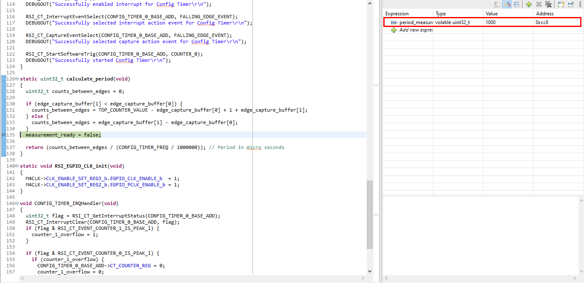

# Peripheral Example - Config Timer - Period Measurement #

## Summary ##

This project demonstrates period measurement using Config Timer. This project configures the timer to request an interrupt after falling edges occur. In the IRQ handler, in addition to saving the edge times, the overflow flag is checked in order to account for two edges that span the time during which the counter rolls over from 0xFFFFFFFF (Counter 0 is 32 bits wide) to 0.

Upon exiting the IRQ handler, the period is calculated and returned as an integer value in microseconds, thus the measuredPeriod value will
show 1000 for an input signal with a period of 1 kHz.

## SDK Version ##

- [SiSDK v2025.6.2](https://github.com/SiliconLabs/simplicity_sdk/releases/tag/v2025.6.2)
- [WiSeConnect SDK v3.5.2](https://github.com/SiliconLabs/wiseconnect/releases/tag/v3.5.2)

## Software Required ##

- [Simplicity Studio v5 IDE](https://www.silabs.com/developers/simplicity-studio)

## Hardware Required ##

- 1x Silicon Labs Si91x device, such as:
  - [SIWX917-DK2605A](https://www.silabs.com/development-tools/wireless/wi-fi/siwx917-dk2605a-wifi-6-bluetooth-le-soc-dev-kit)
  - [SIWX917-RB4338A](https://www.silabs.com/development-tools/wireless/wi-fi/siwx917-rb4338a-wifi-6-bluetooth-le-soc-radio-board) + [Si-MB4002A](https://www.silabs.com/development-tools/wireless/wireless-pro-kit-mainboard?tab=overview)
  - [SiW917Y-EK2708A](https://www.silabs.com/development-tools/wireless/wi-fi/siw917y-ek2708a-explorer-kit?tab=overview)
- A source of periodic signal, which should be connected to the input GPIO

## Connections Required ##

- Refer to the table below to connect the periodic signal to the appropriate input pin.

  | Description | BRD4338A + BRD4002A | BRD2605A | BRD2708A |
  | --- | --- | --- | --- |
  | INPUT | GPIO_25 [P25] | GPIO_25 [P2] | GPIO_25 [SCK] |

> [!TIP]
>
> - Ensure that the source of the periodic signal and the board share the same ground (GND).
> - Refer to the official Silicon Labs documentation for the correct hardware layout of the board.

## Setup ##

### Create from EXAMPLE PROJECTS & DEMOS ###

1. From the Launcher Home, add your hardware to My Products, click on it, and click on the EXAMPLE PROJECTS & DEMOS tab. Find the example project filtering by "config timer - period measurement".
2. Create the project in Simplicity Studio.
3. Build and flash the example to your device.

### Create from an empty example project ###

1. Create an "SL Si91x - Empty C Project SoC" for your board using Simplicity Studio v5. Use the default project settings.
2. Copy the `src/app.c` file into the project root folder, overwriting the existing file.
3. Build and flash the example to your device.

## How It Works ##

Input capture is a functionality of the timer module that enables precise recording of the counter value when an external event, such as a rising or falling edge, is detected on a designated input pin. This feature is particularly advantageous for accurately determining the frequency, period, or pulse width of an input signal.
When a falling edge is detected, the Config Timer captures the event and stores the captured value in a buffer. Upon detecting the subsequent falling edge, the period of the signal is calculated by subtracting the first captured value from the second. The resulting difference is then divided by the frequency of the Config Timer clock to determine the signal's period in microseconds.

## Testing ##

1. Build the project and download it to the Kit
2. Connect a periodic signal to the GPIO pin specified as described in [Hardware Required](#hardware-required)
3. Go into debug mode and click run
4. View the period_measurement_us (period in us) global variable in the debugger. The result should be similar to the following:

   

## Reporting Bugs/Issues and Posting Questions and Comments ##

To report bugs in the Application Examples projects, please create a new "Issue" in the "Issues" section of this repo. Please reference the board, project, and source files associated with the bug, and reference line numbers. If you are proposing a fix, also include information on the proposed fix. Since these examples are provided as-is, there is no guarantee that these examples will be updated to fix these issues.

Questions and comments related to these examples should be made by creating a new "Issue" in the "Issues" section of this repo.
