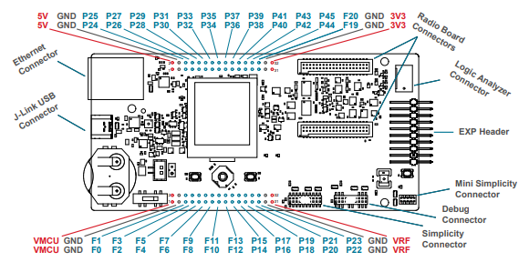
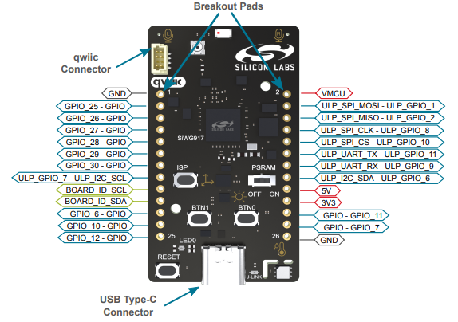

# Peripheral Example - Config Timer - Pulse Capture #

## Summary ##

This project demonstrates how to configure the **config timer** to capture an input pulse. The GPIO pin is configured as an input and the **config timer** is set to capture every falling edges of the signal.

## SDK Version ##

- [SiSDK v2024.12.2](https://github.com/SiliconLabs/simplicity_sdk/releases/tag/v2024.12.2)
- [Wiseconnect v3.4.2](https://github.com/SiliconLabs/wiseconnect/releases/tag/v3.4.2)

## Software Required ##

- [Simplicity Studio v5 IDE](https://www.silabs.com/developers/simplicity-studio)

## Hardware Required ##

- 1x Silicon Labs Si91x device:
  - [SIWX917-DK2605A](https://www.silabs.com/development-tools/wireless/wi-fi/siwx917-dk2605a-wifi-6-bluetooth-le-soc-dev-kit)
  - [SIWX917-RB4338A](https://www.silabs.com/development-tools/wireless/wi-fi/siwx917-rb4338a-wifi-6-bluetooth-le-soc-radio-board?tab=overview)
- A source of pulse, which should be connected to the input GPIO

## Connections Required ##

- Connect the pulse source to the input capture GPIO pin, which is GPIO_25 for both BRD2605A and BRD4338A (P25 on the breakout pad):

  

  

## Setup ##

### Create from EXAMPLE PROJECTS & DEMOS ###

1. From the Launcher Home, add your hardware to MyProducts, click on it, and click on the EXAMPLE PROJECTS & DEMOS tab. Find the example project filtering by "pulse capture".
2. Create the project in Simplicity Studio.

### Create from an empty example project ###

1. Create an "Empty C Project" for your board using Simplicity Studio v5. Use the default project settings.

2. Copy `app.c` into the project root folder (overwriting existing file):

3. Install software components:
    - Open the .slcp file in the project.
    - Select the SOFTWARE COMPONENTS tab.
    - Install the following components:
        - [WiSeConnect 3 SDK] → [Device] → [Si91x] → [MCU] → [Peripheral] → [GPIO]

## How It Works ##

Input capture is a functionality of the timer module that enables precise recording of the counter value when an external event, such as a rising or falling edge, is detected on a designated input pin. This feature is particularly advantageous for accurately determining the frequency, period, or pulse width of an input signal.
When a falling edge is detected, the Config Timer captures the event and stores the captured value in a buffer.
