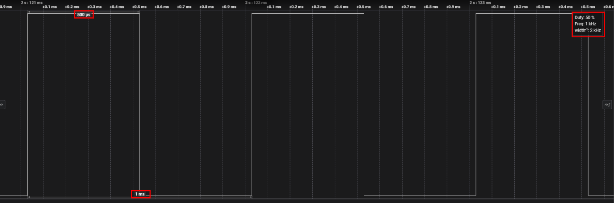

# Peripheral Example - Config Timer - PWM Generator #

## Summary ##

This project demonstrates how to generate a PWM signal using the Config Timer peripheral. The timer is configured to toggle a GPIO pin at a specified frequency and duty cycle, creating a PWM output suitable for controlling devices such as motors, LEDs, or other peripherals requiring pulse-width modulation.

## SDK Version ##

- [SiSDK v2025.6.2](https://github.com/SiliconLabs/simplicity_sdk/releases/tag/v2025.6.2)
- [WiSeConnect SDK v3.5.2](https://github.com/SiliconLabs/wiseconnect/releases/tag/v3.5.2)

## Software Required ##

- [Simplicity Studio v5 IDE](https://www.silabs.com/developers/simplicity-studio)

## Hardware Required ##

- 1x Silicon Labs Si91x device, such as:
  - [SIWX917-DK2605A](https://www.silabs.com/development-tools/wireless/wi-fi/siwx917-dk2605a-wifi-6-bluetooth-le-soc-dev-kit)
  - [SIWX917-RB4338A](https://www.silabs.com/development-tools/wireless/wi-fi/siwx917-rb4338a-wifi-6-bluetooth-le-soc-radio-board) + [Si-MB4002A](https://www.silabs.com/development-tools/wireless/wireless-pro-kit-mainboard?tab=overview)
  - [SiW917Y-EK2708A](https://www.silabs.com/development-tools/wireless/wi-fi/siw917y-ek2708a-explorer-kit?tab=overview)
- An oscilloscope or logic analyzer to observe the PWM output.

## Connections Required ##

- Refer to the table below to connect the PWM output pin to an oscilloscope/logic analyzer.

  | Description | BRD4338A + BRD4002A | BRD2605A | BRD2708A |
  | --- | --- | --- | --- |
  | OUTPUT | GPIO_29 [P33] | GPIO_29 [P11] | GPIO_29 [AN] |

> [!TIP]
> Refer to the official Silicon Labs documentation for the correct hardware layout of the board.

## Setup ##

### Create from EXAMPLE PROJECTS & DEMOS ###

1. From the Launcher Home, add your hardware to My Products, click on it, and click on the EXAMPLE PROJECTS & DEMOS tab. Find the example project filtering by "config timer - PWM generator".
2. Create the project in Simplicity Studio.
3. Build and flash the example to your device.

### Create from an empty example project ###

1. Create an "SL Si91x - Empty C Project SoC" for your board using Simplicity Studio v5. Use the default project settings.
2. Copy the `src/app.c` file into the project root folder, overwriting the existing file.
3. Build and flash the example to your device.

## How It Works ##

The Config Timer is set up to generate a PWM signal by toggling a GPIO pin at a specified frequency and duty cycle. The timer counts up to a value corresponding to the desired period, then toggles the output pin to create the high and low phases of the PWM waveform. By adjusting the timer's compare values, you can control both the frequency and the duty cycle of the PWM output.

## Testing ##

Connect the PWM output pin to an oscilloscope or logic analyzer. Observe the waveform and verify that the frequency and duty cycle match the configured values. You should see a stable PWM signal similar to the following:

## Reporting Bugs/Issues and Posting Questions and Comments ##

To report bugs in the Application Examples projects, please create a new "Issue" in the "Issues" section of this repo. Please reference the board, project, and source files associated with the bug, and reference line numbers. If you are proposing a fix, also include information on the proposed fix. Since these examples are provided as-is, there is no guarantee that these examples will be updated to fix these issues.

Questions and comments related to these examples should be made by creating a new "Issue" in the "Issues" section of this repo.
