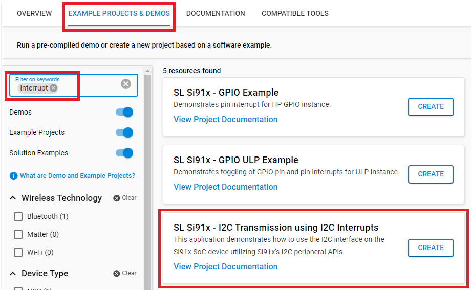
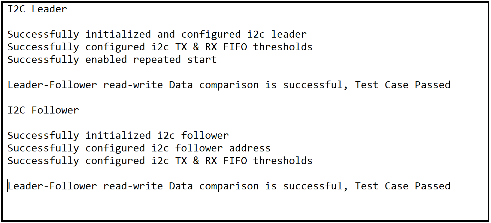

#  Peripheral Example - I2C - Leader with Interrupts


## Purpose/Scope ##

The application demonstrates the data transfer from Leader to Follower and then Follower to Leader utilizing I2C. After the round-trip transmission, the input and output data are compared to verify the integrity of the communication, and the result of this comparison is printed on the console.

> **Note:** The master-slave terminology is now replaced with Leader-Follower. Master is now recognized as Leader and slave is now recognized as Follower.

## Overview ##

- The I2C will be configured in Leader mode. The SCL and SDA lines of the Leader controller are connected to SCL and SDA pins of the Follower.
- The I2C interface allows the processor to serve as a Leader or Follower on the I2C bus.
- I2C can be configured with the following features:
  - I2C standard compliant bus interface with open-drain pins
  - Configurable as Leader or Follower
  - Four speed modes: Standard Mode (100 kbps), Fast Mode (400 kbps), Fast Mode Plus (1 Mbps), and High-Speed Mode (3.4 Mbps)
  - 7 or 10-bit addressing and combined format transfers
  - Support for clock synchronization and bus clear

## SDK version ##

- [SiSDK v2024.12.2](https://github.com/SiliconLabs/simplicity_sdk)

## How It Works ##

This example code demonstrates I2C data transfer between a Leader and Follower using interrupt-driven I2C.

- The first I2C instance is initialized using `i2c_leader_interrupt_init` API to configure `sl_i2c_init_params_t`. This structure holds the I2C initialization parameters.

- It also sets up I2C clock and configures I2C SDA and SCL pins.

- Now `i2c_write_buffer` is filled with some data, which needs to be sent to the Follower.

- In while loop, `i2c_leader_interrupt_process_action` API is running continuously. 

- Current_mode enum is set to I2C_SEND_DATA, and it calls `i2c_send_data` API to send data to the the Follower and configures the Follower address through `sl_si91x_i2c_set_follower_address` for Application.

- Transmit and receive FIFO threshold values are configured using `sl_si91x_i2c_set_tx_threshold` and `sl_si91x_i2c_set_rx_threshold` API.

- Set transmit empty interrupt and enable I2C interrupts using `sl_si91x_i2c_set_interrupts` and `sl_si91x_i2c_enable_interrupts` API. From this point, Leader will be sending byte by byte from `i2c_write_buffer` to Follower until the buffer is empty. In receiving mode, the same APIs are called once again to set and enable receive full interrupt.

- Once all bytes are sent, the mode switches to I2C_RECEIVE_DATA. Leader receives data from Follower through `i2c_receive_data`.

- Now it compares the data, which is received from Follower device to the data, which it has sent.

- If the data matches, it will print "Test Case Passed" on the console.

- When all bytes are received, the mode changes to I2C_TRANSMISSION_COMPLETED.

- The I2C driver enters I2C_TRANSMISSION_COMPLETED mode and stays idle.

> **Note:**
>
>- I2C has three instances (I2C0, I2C1, and ULP_I2C). This example only demonstrates the use case using ULP_I2C (I2C2).
>- I2C0, I2C1 are not working as expected.

## Prerequisites ##

### Software Requirements ###

- Simplicity Studio
  - Download the [Simplicity Studio v5 IDE](https://www.silabs.com/developers/simplicity-studio)
  - Follow the [Simplicity Studio User Guide](https://docs.silabs.com/simplicity-studio-5-users-guide/1.1.0/ss-5-users-guide-getting-started/install-ss-5-and-software#install-ssv5) to install Simplicity Studio IDE
- [Simplicity SDK Version 2024.12.2](https://github.com/SiliconLabs/simplicity_sdk/releases/tag/v2024.12.0)
- [WiSeConnect 3.4.2 SDK](https://github.com/SiliconLabs/wiseconnect/releases/tag/v3.4.2)

### Hardware Requirements ###

- Windows PC

- 2x [BRD4002A WSTK board](https://www.silabs.com/development-tools/wireless/wireless-pro-kit-mainboard?tab=overview) as a Follower or Leader

- 2x [Wi-Fi Development Kit](https://www.silabs.com/development-tools/wireless/wi-fi) based on SiWG917 (e.g. [SIWX917-RB4338A](https://www.silabs.com/development-tools/wireless/wi-fi/siwx917-rb4338a-wifi-6-bluetooth-le-soc-radio-board)) as a Follower or Leader

### Hardware Connection ###

**ULP_I2C:**

| PIN |   BRD4338A + BRD2605A      | Description                  |
| --- | -------------------------- | ---------------------------- |
| SCL | ULP_GPIO_7 [EXP_HEADER-15] |  Connect to Follower SCL pin |
| SDA | ULP_GPIO_6 [EXP_HEADER-16] |  Connect to Follower SDA pin |


## Setup ##

**For Leader:**

You can only create a project based on an example project.

1. From the Launcher Home, add your board to My Products, click on it, and click on the **EXAMPLE PROJECTS & DEMOS** tab. Find the example project with filtering by *interrupt*.

2. Click **Create** button on the **SL Si91x - I2C Transmission using I2C Interrupts** example. Example project creation dialog pops up -> click Create and Finish and Project should be generated.

   

3. Build and flash this example to the board.


**For Follower:**
> [!TIP]
> Refer to [this](https://github.com/SiliconLabs/wiseconnect/tree/master/examples/si91x_soc/peripheral/sl_si91x_i2c_driver_follower) to compile and run the I2C application for Follower mode.

## Application Build Environment

### Application Configuration Parameters

- After creating the project, configure the following macros in `i2c_leader_interrupt.c` file. Update or modify the following macros, if required.

    ```c
      #define I2C_USED                    // Update it with I2C instance number used for this application: 0 for I2C0, 1 for I2C1 and 2 for I2C2
      #define FOLLOWER_I2C_ADDR           // Update I2C follower address
      #define I2C_BUFFER_SIZE             // To change the number of bytes to send and receive.Its value should be less than maximum buffer size macro value.
    ```

- Configure mode, operating-mode, and transfer-type of I2C instance by modifying the following code snippet.
- Change `config.mode` to 'Leader mode'.
- Change `config.clhr` as per bus-speed requirement.

    ```c
      config.clhr = SL_I2C_FAST_PLUS_BUS_SPEED;   // Update this value to choose desired I2C bus speed.
      config.mode = SL_I2C_LEADER_MODE;           // Update this value to change between Leader and Follower mode
    ```
  
> **Note:** After completing the above configurations, connect the SCL and SDA pins of Leader and Follower and run the application. Observe the results by connecting SDA and SCL pins to the Logic Analyzer. (If required, enable the glitch filter for the SCL channel with time period 100ns,to avoid glitches).

- For getting proper speeds with Fast Mode and Fast Mode Plus, use external pullup of around 4.7K.
- For high-speed mode data transfer external pullup is a must.

## Test the Application ##

Refer to the instructions [here](https://docs.silabs.com/wiseconnect/latest/wiseconnect-getting-started/) to:

1. Compile and run the application.
2. Connect the SCL(ULP_GPIO_7) and SDA(ULP_GPIO_6) pins with the follower device. If you are using a SiWG915 board, connect SCL(GPIO_7) and SDA(GPIO_6) pins with the leader device.
3. When the application runs, it receives and sends data.
4. After the transfer is completed, it validates the data and prints "Test Case Passed" on the console.
5. Connect Analyzer channels to respective I2C instance SDA & SCA pins to observe the data on lines.
6. After successful program execution, the outputs on the serial console looks as shown below.

   
